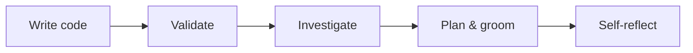
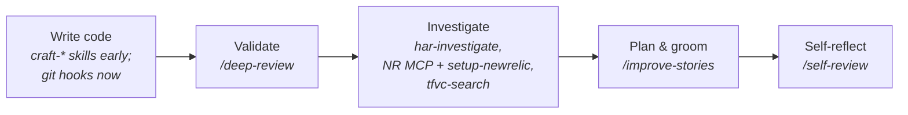
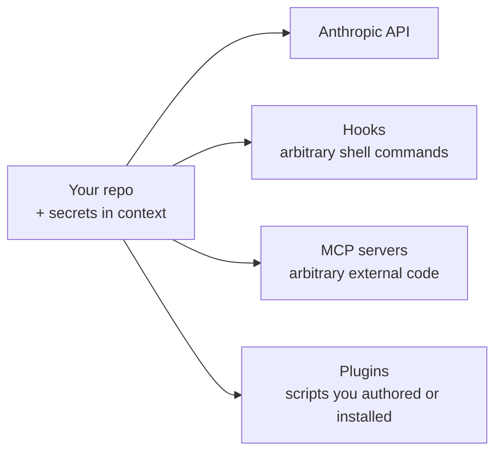
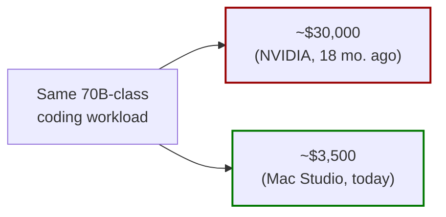
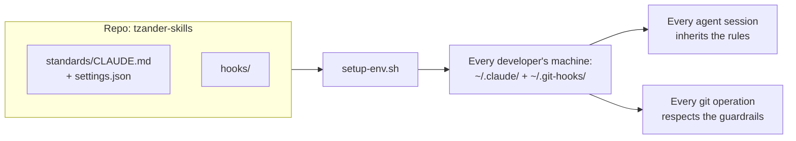

# How I Use Claude Code — Six Months In

*Tim Zander — May 2026*

How my use of Claude has evolved over six months of daily work — from "paste a function, ask for changes" into a collaborator across the whole development lifecycle. The goal is to share a working mental model, walk through what a real session looks like, tour the tooling I've built (in [this repo](https://github.com/TimZander/claude)), and be honest about the pitfalls — especially around security.

> **A note on the timing.** This is dated May 2026, and we are in a time of great upheaval in this space. Models, hardware SKUs, prices, and even whole product lines move faster than this document can. Every specific reference below — Claude Opus 4.7, Qwen2.5-Coder 72B, the M4 Max Mac Studio at $3,329 — is a snapshot. Some of these will be obsolete within months. The *patterns* should be more durable than the specifics. When in doubt about a referenced product, model, or price, check current state before acting. See the "About this document" footer for a sharper read on what's likely to age fastest.

**Purpose note.** This is knowledge-sharing, not tool advocacy. If you're using Cursor, Antigravity, or another harness today and it's working for you, my goal is to help you work *better* in it — not migrate you to mine. Anything that happens to sway someone either way is a side effect, not the point.

---

## 1. How I got here

Six months ago I was using Claude to write code. That was it: paste a function, ask for changes, copy-paste back. Pair-programming with a chatbot.

Today I'm using Claude across the whole development lifecycle — *with* me, not just *for* me. It plans. It writes user stories. It does the work. It reviews the work. It reviews itself. The role has expanded from "code writer" to "collaborator across the SDLC," and that expansion is the through-line.

The arc, in five steps:

1. **Write code** — the obvious starting point.
2. **Validate code** — code review, both my own and others'.
3. **Investigate** — read logs, trace API flows, search source I don't even have locally.
4. **Plan and groom** — turn fuzzy issues into stories with enough context to be executable.
5. **Self-reflect** — sessions critiquing themselves, surfacing improvements to my own tools and standards.

Each of those steps used to be entirely my job. Now they're shared.

---

## 2. Model vs harness — and why they're not interchangeable

This is the single biggest mental-model upgrade I want everyone to walk out with — *independent of which tool you actually use.* The framework matters more than my personal choice. I'll get to my choice last, and frame it as a data point, not a recommendation.

**Two separate decisions:**

- **The model** is the engine. Opus 4.7, Sonnet 4.6, Gemini, GPT-5, etc. This is what's actually thinking.
- **The harness** is everything around the model: how it reads files, runs commands, remembers things, gets permission, integrates with your editor, manages context, calls tools, schedules work. Claude Code, Cursor, Antigravity, Cline are all harnesses.

You pick both. They're independent in principle, linked in practice. Every cell in the grid below is a real combination someone is using productively today:

| Harness ↓ / Model → | Opus 4.7 | Sonnet 4.6 | GPT 5.5 Pro | Gemini |
|---|---|---|---|---|
| **Claude Code** | ★ *my choice* | ✓ viable | ✓ viable | ✓ viable |
| **Cursor** | ✓ viable | ✓ viable | ✓ viable | ✓ viable |
| **Antigravity** | ✓ tested* | ✓ viable | ✓ viable | ✓ tested* |
| **Cline / others** | ✓ viable | ✓ viable | ✓ viable | ✓ viable |

*via skill port — see portability paragraph below

**My take on the model:** Opus has been qualitatively better than Gemini for the work I do — C#, ADO, SQL, Azure stack, messy real-world repos. I want to be honest that this is *my* domain experience, not a universal claim. If you're writing Python ML pipelines or React-heavy frontends, your mileage may vary. Try both on a representative task before committing.

**Watch this space.** GPT 5.5 Pro was released just before I wrote this. I haven't tested it personally, but published benchmarks show it closing the gap on Opus 4.7 — though a measurable gap remains. The "Opus is the best for our work" claim is dated specifically to May 2026 — in twelve months it could flip. Don't take my word for it; re-test on a representative task at least every six months and verify against your own workload.

**My take on the harness — for me, specifically:** Claude Code wins for two reasons:

1. **Economics.** Claude Code's Max plan gives the most Opus tokens per dollar of any harness I've tested. The harness choice is partly *economic access* to the better model. This part is universal — anyone weighing harness options should run the cost math on their projected usage.
2. **Ergonomics — and this part is *not* universal.** Slash commands, plugins, hooks, MCP servers, agents, worktrees, scheduling, and a real CLI that lives where my work already lives. I have personally trialed other harnesses and keep coming back. But Claude Code's CLI-first style fits my Linux/bash/vim roots — keyboard-driven, text-stream, "I'd rather type than click." If you came up in IDEs and prefer rich GUI affordances, Cursor's editor-integrated experience may serve you better. If you want the more autonomy-forward agentic style, Antigravity is worth a serious look. **The economics point is more universal than the ergonomics point — but ergonomics is what you feel every day, so weight it accordingly.**

So the two choices aren't independent: I picked the model first based on quality for my stack, then picked the harness that gets me the most of that model per dollar *and* fits how I work. Your second factor may differ from mine.

**One more thing — the harness choice is lower-stakes than it looks.** The plugins, standards, and skills in this repo are written as files — markdown, JSON, shell scripts. They're not locked to Claude Code's runtime. I successfully ported the skills in this repo to Antigravity and ran them under both Anthropic and Google models in that harness. The translation took some effort but it was tractable. So when I say "I'm picking Claude Code today," I'm picking it for the next year or so, not for life. If the harness landscape shifts — if Cursor wins on capability, or Antigravity matures faster than expected, or something new emerges — the investment in standards, plugins, and discipline doesn't evaporate. It travels. **That's the deeper reason "as code" matters (§8): configuration that lives in files is portable in a way that configuration in someone's head is not.**

---

## 3. What a real session looks like

To make this concrete, here's the rhythm of picking up an issue, doing the work, and opening a PR:

- **Before the session, separately:** `/improve-stories` to groom the issue. I run grooming separately — sometimes days before picking up the work — because story grooming and execution are different modes of thinking, and mashing them together usually means the grooming gets short-changed.
- `/start-work <issue>` — creates a fresh worktree on a new branch (default behavior; configurable per developer), marks the work-item active, syncs from main.
- Code the change interactively, with Claude proposing and me steering.
- `/deep-review` on the branch — multi-agent review against my team's standards.
- Ask Claude to draft the PR title and body, then run `gh pr create` directly — no dedicated skill for this anymore (more on why in §5).
- Push, PR, ship.

The point isn't the result. It's the **rhythm** — how often I'm pausing to confirm direction, how often I'm pushing back when Claude wants to over-engineer, what the conversation looks like when it's working well. When a session goes sideways — and it sometimes does — that's where the lessons are.

**Worktrees are an important part of how I work in parallel.** I don't keep static worktrees for fixed roles like "code" or "review" — each user story I pick up gets its own worktree on its own branch with its own Claude session. `/start-work` creates the worktree automatically by default; it's configurable to skip if a developer prefers to work in place — different setup for different workflows. On a real working day, I might have three or four active at once: Claude implementing feature A in one, `/deep-review` running on PR B in another, story grooming for C in a third. Each is independent — separate filesystem, separate context, no shared state. When a story ships, the worktree gets cleaned up. **The discipline is one worktree per unit of work — spin one up when you start, tear it down when you ship.** Standing up a worktree manually is `git worktree add` — roughly zero friction — and it's what lets multiple Claude sessions make progress in parallel without stepping on each other. If you've never used `git worktree`, it's a cheap experiment with a high ceiling.

---

## 4. The discipline shift: write everything down

This is the thing nobody warned me about, and it changes how you do engineering work.

**Before:** A senior engineer carries a lot of context in their head. The architecture, the gotchas, the "we tried that and it didn't work," the unwritten conventions, who to ask about what. Junior engineers absorb this through hallway conversations, code review, lunches, and time. Documentation is nice-to-have. Tests prove the code works *enough*.

**After:** The agent has no head. It reads what's written down and nothing else. If a constraint is only in someone's brain, the agent will violate it. If a convention is "obvious to anyone who's been here a year," the agent will fight it. If the test doesn't exist, the agent has no signal that it broke something. **The agent only knows what's encoded — in code, comments, tests, stories, standards, and CLAUDE.md.**

The practical consequences:

- **Tests matter more, not less.** Tests are how the agent — and any future agent on this codebase — knows whether it broke something. AI-generated code without tests is a regression machine.
- **Documentation matters more, not less.** Especially the *why*. Code shows the *what*; the agent can derive that. Why we don't use the obvious approach, why this validation exists, why the constraint is what it is — that has to be written.
- **User stories matter more, not less.** A story that says "fix the bug in the report" is unworkable for an agent. A story with repro steps, expected vs. actual, the affected code paths, and the acceptance criteria is workable. **This is exactly what `/improve-stories` does.** It's the bridge from "humans-talk-it-out" to "agent-can-execute."
- **Standards matter more, not less.** Naming, formatting, testing patterns, review rigor — encoded in `standards/CLAUDE.md` and `standards/settings.json` so every agent in every session inherits them.

If you're a manager or business analyst reading this: the part that's about *you* is here. Your team's leverage with AI is bounded by the quality of the artifacts you give it. Investing in stories, decisions, and documentation is investing in agent throughput.

---

## 5. The repo tour — role expansion in commits

[`tzander-skills`](https://github.com/TimZander/claude) is a Claude Code plugin marketplace and team standards hub. Roughly 230 commits over six months. Reading the git log chronologically, you can see the role expansion happen in real time — same arc as §1, now populated with the tooling that backs each phase:

**Phase 1 — Write code, with explicit guardrails (early commits).**
The first plugins were `craft-commit`, `craft-stage`, and `craft-pr` — small, mechanical scripts that made every git interaction its own explicit slash command. Honestly: low ambition. They existed because I wasn't yet comfortable letting Claude touch git directly. Each step had its own command so I could see and approve the agent's intent before anything ran.

**The more interesting part is what I do now.** I no longer use the craft-* skills myself — but I want to be precise about why, because this is a style choice, not a skill ladder. The per-step skills make every git operation explicit: separate commands for stage, commit, and PR, each one a deliberate pause point. That's a perfectly reasonable working style. For me personally, after enough sessions watching Claude handle git well, those pauses started to feel like friction rather than safety, so I shifted to *systemic* guardrails instead: pre-commit and pre-push hooks at the repo level (in `hooks/`, installed by `setup-env.sh`) that block force pushes, prevent direct pushes to `main`, and enforce the right commit email. The hooks catch the operations that are actually dangerous; everything else flows without per-step approval. **The broader pattern worth noticing: there's a spectrum from explicit per-step skills to systemic-constraint-with-fluid-execution, and you can sit anywhere on it that fits how you like to work. Start where you're comfortable, slide along as your trust calibrates.** The craft-* skills are absolutely a valid place to live; I just live somewhere else now.

**Phase 2 — Validate code (`deep-review`).**
The second arc was code review. `deep-review` started as a single command that read the diff and gave feedback. It now spawns parallel sub-agents to scrutinize different angles, calibrates severity, checks against team standards, and surfaces what's *not* in the diff. Multiple iterations, real review findings, repeat. The commits to `deep-review` alone tell a story of escalating rigor.

**Phase 3 — Investigate.**
This is the phase that has saved the most time and is the most legible win. Three flavors of investigation:

- **`har-investigate` (plugin).** Drop a HAR file, the agent reverse-engineers the API — endpoints, auth flows, payload shapes, sequencing. What used to be a half-day of squinting at DevTools is fifteen minutes.
- **New Relic via MCP + `setup-newrelic` (glue skill).** This one's interesting: there's no `investigate-newrelic` plugin, because the New Relic MCP server already exposes the right tools. `setup-newrelic` is a tiny bootstrap that finds the entities for the current repo and writes their GUIDs into the project's `CLAUDE.md`. Then any session in that repo can read New Relic logs without re-discovering the entities every time. **The lesson: not every workflow needs a custom plugin. Sometimes "MCP server + a small `CLAUDE.md` primer" is the whole answer.**
- **`tfvc-search` (plugin).** Read SQL schemas and other code from Azure DevOps TFVC without a local workspace. Saves the song-and-dance of mapping a TFVC workspace just to read three files. **It's also the mechanism that supports the §6.c database-isolation rule** — read schemas, sprocs, and migrations from source control instead of letting the agent touch a live database. What looks like a productivity plugin is also a security control.

**The HAR and New Relic tools in particular have saved a large amount of time.** If you remember nothing else from this section, remember those two — they're the most concrete ROI in the toolkit.

**Phase 4 — Plan and groom (`improve-stories`).**
The role expansion past "write code" starts here. `/improve-stories` reads a backlog of user stories or GitHub issues, researches the codebase to fill in what's missing, and rewrites them with repro steps, acceptance criteria, and code references. This is the bridge artifact that connects the discipline shift in §4 to the actual work the agent does.

**Phase 5 — Self-reflect (`self-review`).**
The most recent role: the agent critiquing the *session itself.* `/self-review` looks at what just happened, identifies repo-specific learnings, team-wide improvements, and skill opportunities, and routes them by scope (this repo vs. global standards vs. new plugin idea). The feedback loop closes.

Reading the plugin list this way, each plugin is a step the LLM has taken into a role I used to do alone. That's the arc.

---

## 6. Pitfalls and security

Now the honest part. The same property that makes the agent useful — it can read everything in context — is also what makes it a security problem.

### a. Ingestion: anything readable is in scope

The agent sees what your shell sees: every file in the working directory, every environment variable, every secret in a `.env` file you forgot was there, every connection string in `appsettings.Development.json` or `local.settings.json`, every Azure CLI token cached in `~/.azure/` from your last `az login`, every ADO PAT you stored in `.gitconfig` or `.npmrc`. If your eyes can read it, the agent can read it, and "reading it" usually means it lands in the conversation context — which means it's been sent to Anthropic.

This is not a bug; it's the model. The mitigation is hygiene.

### b. Secrets — where most teams are, where they need to go

Today, secrets often live in `.env` files, `appsettings.Development.json`, occasional hardcoded connection strings in scratch files, etc. This is not OK. The fix is moving to a secrets vault — Azure Key Vault, AWS Secrets Manager, HashiCorp Vault, whatever fits your stack — so application secrets resolve from the vault at runtime and never sit in repo files. Until that migration is done, **assume any secret in your working tree has been ingested.**

A practical secret-handling rule for now:
- Do not paste secrets into the chat.
- Do not commit them.
- If you discover one in a working tree, rotate it. The fact that the agent saw it means treat it as compromised.

### c. Live databases — the biggest single risk

This is the one that keeps me up. The agent can:
- Read live data — and that data ends up in context, ends up sent to the API, ends up potentially logged.
- Write or mutate via SQL or stored procedures it generates and you approve too quickly.
- Run an exploratory query that scans 50M rows in production because nobody scoped it.

**Rules I follow personally — and they're stricter than "don't connect to prod":**
- **I don't let Claude connect to any database. Period.** Not prod, not staging, not dev. The risk vector isn't "production data leaks" — it's "any data the agent sees lands in the API context." Removing the connection entirely removes the vector.
- **For database *learning* — schema, stored procedures, indexes, migrations — I use source control.** The `tfvc-search` plugin (§5) exists precisely for this: read schema definitions, sproc bodies, and migration scripts from version control without ever touching a live server. The agent gets full structural understanding of the database without seeing a single row of data.
- **If a query genuinely needs to run against a live database, I run it myself.** I copy the SQL Claude proposes, review it, run it in SSMS (or the appropriate client), and paste back only the rows or aggregate I'm willing to share. The agent never holds the connection.
- **Obfuscated/synthetic data only** for any future scenario where Claude *does* get database access. Keep that surface as small as possible.

**Why the rule has to be this strict:** the failure mode is almost always accidental, not deliberate. A connection string in `appsettings.Development.json` that happens to point at a real database. An MCP server installed weeks ago that nobody remembered was active. A `dotnet run` that connects on startup. A test fixture or migration script that hits a real server. An `az` command that pulls live data. These can happen to anyone — and the worst part is you often don't notice until after the fact. Treating "the agent never holds a database connection" as a bright-line rule means accidents have nowhere to land.

### d. The exfiltration surface

This is the part most teams miss until they've done it themselves. The threat surface isn't just "the model API" — it's everywhere data the agent sees can flow outward:

Four exit points, all enabled the moment the agent starts a session:

1. **The model API itself.** Anthropic sees what you send. Their data policy is reasonable, but "reasonable" is not "doesn't exist."
2. **Hooks.** Settings-defined shell commands that run on tool events. They have full system access and see the tool inputs/outputs. A malicious or buggy hook can ship anything anywhere.
3. **MCP servers.** External processes the agent talks to. They run arbitrary code. They see the requests sent to them. Installing a sketchy MCP server is roughly equivalent to installing a sketchy VS Code extension that watches your editor.
4. **Plugins.** Same risk class as MCP — they're configuration, but the configuration runs scripts you authored or installed.

**The rule:** treat hooks, MCP servers, and plugins like dependencies. Audit before installing. Pin to known-good versions. Don't install things from random GitHub URLs. The blast radius is your full repo and any secret reachable from it.

### e. Where this is heading

The security direction over the next 6–12 months for any team using AI tooling at scale:

- **Move to a Team plan if you haven't.** Individual plans don't give the data-handling guarantees a real team needs. The migration is straightforward and the privacy upgrade is real. **It does not substitute for the local LLM (§7).** Team plan still ships data to Anthropic's servers; it just shapes what they do with it. Local-only is the only answer for code that genuinely cannot leave the building. **Worth keeping in mind on TCO:** if your team has multiple high-velocity AI users — folks regularly maxing out individual-plan caps — the shared Team plan allotment will hit those limits faster than people expect. Plan accordingly.
- **Local LLMs** — covered in §7 below.
- **Database data obfuscation** — production-shaped data, no production identities. Required before agents touch any DB with real-customer data.
- **Container or VM isolation for sensitive work** — give the agent a sandbox where the blast radius is contained, even if the agent or a dependency misbehaves.
- **Harder prod separation** — production credentials should not be reachable from a developer laptop, full stop. Today some are. That has to change before agents become more autonomous.

---

## 7. The local LLM frontier

This is the most consequential forward-looking item I'm thinking about.

### Four drivers — three defensive, one offensive

The case for engaging with local inference rests on four drivers:

- **Security.** Sensitive code that genuinely shouldn't leave the building has nowhere local to go today.
- **Performance.** Local inference has zero rate limits and zero per-token cost — which changes what's economical to run continuously.
- **Disaster hedge.** Many teams are now structurally dependent on AI tooling for productivity. The risks aren't only outages — pricing model changes, opaque ToS interpretations, and rate-limit / allotment overages can all hamstring a dependent team. The capacity events at least aren't hypothetical: 529 overloaded errors and intermittent rate limits happen during working hours. **A local LLM, configured with graceful fallback when the cloud API errors, would absorb events like that transparently.** The resilience pattern is cloud primary, local fallback, automatic — the team doesn't notice the cloud was down.
- **Staying ahead of the curve.** Open-weights coding models are improving on a 6-month cadence. The operational stack to run them is *learned* capability, not downloadable. Engaging now buys ~18 months of operational lead.

Three defensive, one offensive. Any one alone is a weaker pitch; together they're the case.

### What changed in the last 12-18 months

Two shifts made this newly tractable. Open-weights coding models hit "actually useful" at the 70B class — Qwen2.5-Coder, DeepSeek, Llama 3.3. And Apple Silicon's unified-memory architecture got cheap: a Mac Studio at ~$3,500 can fit a 70B-Q4 model in fast memory. Eighteen months ago the same workload required $30K+ in NVIDIA hardware. The economics moved.

### Where this stands honestly

The directional case is strong. I've done theoretical analysis — memory bandwidth ÷ model size, cross-checked against published third-party benchmarks. I have *not* run the model on the hardware to validate the numbers on the workload my team actually cares about. The validation work is what turns "directionally right" into "deploy with confidence." That's the next step, and it's the kind of thing a 90-day pilot should answer empirically.

### One thing worth landing

Whether or not your team funds a pilot today, the industry is moving here. Anthropic, OpenAI, Google, Microsoft, Meta, and Apple are all betting on a hybrid future of frontier-API plus local inference. Open-weights coding models are improving on a 6-month cadence. Every major IDE and AI tooling company is shipping local-inference paths.

The teams that spend the next 18 months learning the operational stack — model evaluation, hybrid pipelines, prompt patterns, IT integration — get to deploy at scale when the models are unambiguously good enough, instead of starting from zero at that point.

I'd rather be early and slightly wrong about the specifics than late and right about the trajectory.

---

## 8. Standards as code

Quick section, but load-bearing.

`standards/CLAUDE.md` and `standards/settings.json` are the team's coding rules and tool permissions, version-controlled. The `setup-env.sh` script syncs them into every developer's `~/.claude/` directory **and installs the git hooks from `hooks/`** — pre-commit and pre-push checks that block the operations we never want any agent (or human) to perform unsupervised: pushing to `main`, force-pushing, committing with the wrong email. Update the standards or the hooks in this repo, every developer re-runs the script, every agent in every session inherits the change.

Why this matters: the discipline shift in §4 is unenforceable if every developer encodes their own standards in their own head. Putting the standards in a repo, syncing them to every machine, and writing them in a form the agent reads on every session — that's how a team scales shared rules without nagging. The hooks layer is what makes the *systemic* guardrails from §5 possible — the agent can move fast on the safe operations because the dangerous ones are blocked at the system level rather than requiring per-step human approval.

---

## 9. What's next

Local LLM is in §7. Beyond that, the open issues and frontiers on my radar for the next 6 months:

- **Custom agents (an honest gap in my toolkit).** Everything I've built in this repo is a *skill* or a *plugin* — one-shot slash commands the user invokes for a specific task. I have not yet explored writing custom *agents*: specialized sub-agents with their own tool access, system prompt, and persona, designed to be spawned for a specific role rather than a specific task. **Skills delegate tasks; agents delegate roles.** Examples worth building: a security-reviewer agent with read-only tools and a sharpened threat-modeling prompt; a test-writer agent that only writes and runs tests; a refactor-scout that finds candidates and reports without changing code. This is the next design surface for me to learn — and it's the prerequisite for the bullet immediately below.
- **[#100](https://github.com/TimZander/claude/issues/100) — First long-running agent: a PR review agent.** The first long-running agent we deploy is *not* the fully autonomous "pick up a story, do the work, open a PR" agent — that one is further down the road. The first one is a PR review agent, triggered when a PR is published, running deep-review-style analysis automatically and posting findings as review comments. **The goal is to reduce latency between PR published and first reviewer feedback.** This is the right starting point because the agent's scope is small and well-defined, the failure modes are visible and recoverable (a bad review comment is annoying, not catastrophic), and it builds on infrastructure already in place (`deep-review`) rather than requiring greenfield work. The fully autonomous "story-to-PR" agent comes after we've calibrated trust at this lower-stakes layer. Custom agents (above) are the prerequisite design surface for both. The discipline shift in §4 is a prerequisite for the autonomous flavor specifically — long-running agents fail catastrophically on under-specified work.
- **[#127](https://github.com/TimZander/claude/issues/127) — Scheduling research.** Time-based actions: run X every morning, watch Y after deploys, page me if Z. Capability is shipping; the question is what's worth scheduling vs. what creates noise.
- **[#130](https://github.com/TimZander/claude/issues/130) — Memory routing.** My personal Claude Code memory has team-applicable gotchas trapped in it. Routing those into shared standards is the path from individual learning to team learning — **lightweight, file-based, version-controlled, synced via `setup-env.sh` to every machine, in line with the rest of the repo's "as code" thesis (§8).** Same pattern as the standards layer: the things the agent should know live in the repo, the script puts them where every session reads them.
- **Database obfuscation.** Pre-req for any agent work involving real schemas.
- **[#132](https://github.com/TimZander/claude/issues/132) — Decision-log skill pilot.** A lightweight place to record "we considered X, chose Y, because Z." The agent can read it later. Without it, every architectural decision has to be re-discovered from code archaeology.

The pattern across all of these: **the agent is going to do more, more autonomously. The work is making sure that's safe, traceable, and aligned with what we actually want.**

---

## 10. Getting started

If you're new to Claude Code and want to try this style:

1. Install Claude Code from [claude.ai/code](https://claude.ai/code). The Max plan is worth it if you're going to use it daily.
2. Browse [my marketplace](https://github.com/TimZander/claude) and install the plugins that look useful. `/deep-review` and `/improve-stories` are good first picks.
3. Run `./setup-env.sh` from a clone of the repo to install team standards and the git hooks if you want them.
4. Read `standards/CLAUDE.md` once, top to bottom. That's the playbook.
5. Use Opus for hard work, Sonnet for the rest, Haiku for mechanical stuff like commit messages.
6. When something annoys you twice, ask yourself if it should be a skill or a standard. That's how this whole repo started.

---

## About this document

**Written:** May 2026
**Author:** Tim Zander
**Status:** Public blog post adapted from a team training session

### The landscape, as of writing

- **Models referenced:** Claude Opus 4.7, Claude Sonnet 4.6, Claude Haiku 4.5, Gemini (personally tested, found lacking for this stack), GPT 5.5 Pro (just released at writing — referenced via third-party benchmarks, not personally tested), Qwen2.5-Coder 72B (Q4_K_M), DeepSeek-Coder-V3, Llama 3.3 70B
- **Primary harness:** Claude Code, on the Anthropic Max plan
- **Other harnesses tested:** Antigravity (skills successfully ported and run under both Anthropic and Google models — proof of portability)
- **Hardware referenced:** M4 Max Mac Studio 128GB (discontinued at writing along with the 32GB tier, kept as the analysis anchor), M3 Ultra Mac Studio 96GB / 192GB, DGX Spark, used A100 80GB
- **Hardware imminent:** M5 Max Mac Studio 128GB+ (Apple expected to ship shortly; currently-sold 64GB M4 Max and 96GB M3 Ultra Studios are not meaningfully useful for the 70B workload per my research)

### What's likely to age fastest

- **Specific model versions.** Anthropic, OpenAI, Google, and the open-weights ecosystem all ship on cadences shorter than this document's expected reading life. By 2027, "Opus" likely refers to a different model than the one I'm using today.
- **Specific hardware SKUs.** Apple Silicon refreshes annually. The M5 line lands within months of writing. The M6 line follows in 2027.
- **Specific token/sec numbers.** These are theoretical to begin with and pinned to specific bandwidth-and-quantization combinations. They will not survive a model or hardware refresh.
- **Specific prices.** Edu pricing, used-market pricing, and cloud-rental pricing all move quarterly.
- **Specific issue numbers.** GitHub issues referenced by number may close or be re-numbered over time.

### What should be more durable

- The **model-vs-harness distinction** (§2)
- The **portability principle** — skills and standards written as files travel across harnesses with effort but not pain. Proven by porting this repo's skills to Antigravity and running them under both Anthropic and Google models. (§2 and §8)
- The **role-expansion arc** across the SDLC (§5)
- The **discipline shift** toward writing things down (§4)
- The **pitfalls** — ingestion, secrets, live databases, exfiltration surface (§6)
- The **four drivers for local inference** — defensive triplet (security, performance, disaster hedge) plus the offensive driver (staying ahead of the curve) (§7)

If you're reading this 12+ months after May 2026, treat the specifics as time capsule and the framework as the actual content.
